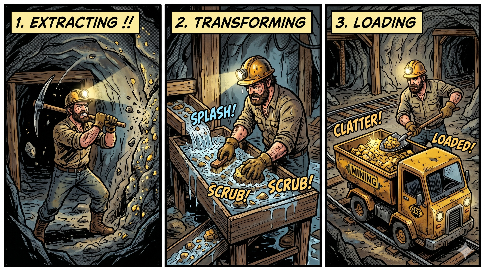

# What are the three phases of an ETL job in AWS Glue?

---

- **Extract** — query the data source for relevant data (new records, time ranges, specific fields)
- **Transform** — reshape and clean raw data via Apache Spark or Python scripts
- **Load** — write transformed data to its destination (database, warehouse, or S3)

