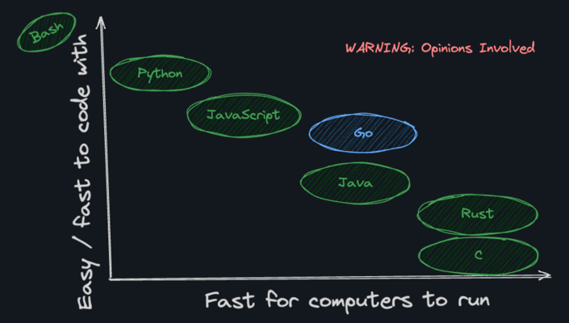

How does Go's speed compare to other languages?

---

**Faster than** (interpreted/VM):
Python, JavaScript, PHP, Ruby, Java

**Slower than** (compiled):
C, C++, Rust

Go is compiled but not as low-level as C/Rust, making it a good balance of speed and developer experience.

---

