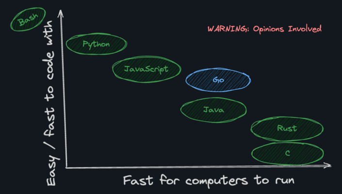

# Why Go

Why choose Go for your next project?

***

Go offers:
- **Fast and lightweight** runtime
- **Easy concurrency** with goroutines
- **Simple and easy** to learn
- **Fast compilation**
- **Statically typed** for safety
- **Garbage collected** for automatic memory management

# Fast and compiled

Why is Go considered a "Fast and Compiled" language compared to interpreted languages?

***

- It compiles directly to machine code, making it significantly faster than interpreted languages like JavaScript, Python, and Ruby.
- While slightly slower in execution than C, Rust, or Zig, Go features much faster compilation times, improving developer productivity.
- The fast compilation eliminates the "swordfighting" (waiting for builds) often found in other compiled language teams.

# Compiled vs interpreted

Compiled vs Interpreted Code

***

**Interpreted code problems:**
- User needs to download the interpreter first
- Developer needs to give source code out

**Compiled code advantages:**
- No runtime dependencies
- Fast execution
- Small memory footprint

# Speed

How does Go's speed compare to other languages?

***

**Faster than** (interpreted/VM):
Python, JavaScript, PHP, Ruby, Java

**Slower than** (compiled):
C, C++, Rust

Go is compiled but not as low-level as C/Rust, making it a good balance of speed and developer experience.

# Runtime

What is the Go runtime?

***

The Go runtime is a small amount of extra code included in the executable binary that:
- Runs the garbage collector to automatically free up memory no longer in use
- Manages other runtime services needed by Go programs

# Goroutines

What are goroutines in Go?

***

Goroutines are lightweight coroutines that are lighter weight than operating system threads, but still take advantage of multiple CPU cores.

# Node comparison

What type of workload is Node.js/Express best suited for?

***

Node.js and Express work well for I/O-bound tasks (like most CRUD apps where processing is offloaded to the database).

How does Node.js/Express handle concurrent requests?

***

Node.js servers are typically single-threaded and use an async event loop. When a request has to wait on I/O (like to a database), the server puts it on pause and does something else.
